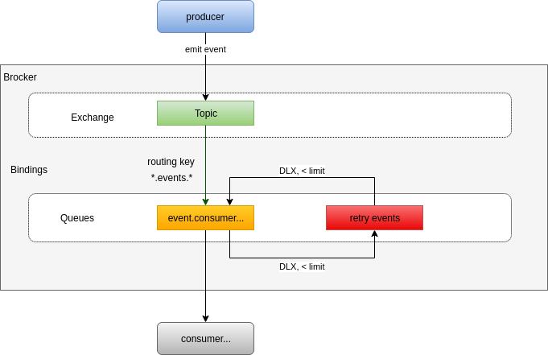

# AMQP Event
Module to create and manage events use RabbitMQ (amqplib).

## How does AMQP Event work?


### Constructor
```js
/**
 *
 * @param {object} options
 * @param {string} [options.url]
 * @param {string} [options.protocol] The to be used protocol.  Default value: 'amqp'.
 * @param {string} [options.hostname] Hostname used for connecting to the server. Default value: 'localhost'.
 * @param {number} [options.port] Port used for connecting to the server. Default value: 5672.number.
 * @param {string} [options.username] Username used for authenticating against the server. Default value: 'guest'.
 * @param {string} [options.password] Password used for authenticating against the server. Default value: 'guest'.
 * @param {string} [options.prefix] Default value: 'amqpe'.
 * @param {string} [options.exchange] Is the name of the exchange - It like a domain that the events belong to.
 * @param {boolean} [options.durable]
 * @param {string} [options.consumer]
 */
constructor(options) => void;
```
When we create an instance of `AMQPEvent` class:

```js
const AMQPEvent = require('@zerocore/amqp-event');

//Create an instance for the producer
const producer = new AMQPEvent({
  exchange: 'producer-service'
});

//Create an intance for the consumer
const consumer = new AMQPEvent({
  exchange: 'producer-service',
  consumer: 'consumer-service'
});
```

It will create an exchange with the name `${options.prefix}.${options.exchange}`, type is `topic`. In this example is `amqpe.producer-service`. In there:
- `amqpe`: is default prefix.
- `producer-service`: is the name of the exchange - It like a domain that the events belong to.

### Emitting event
```js
/**
 * @param {string} event
 * @param {string|Buffer} msg
*/
async emit(event, msg) => Promise<Boolean>
```

When we emited an event:
```js
producer.emit('message_puslished', JSON.stringify(user));
```
This event will be published with a routing key of the form `${options.prefix}.${options.exchange}.emit.${event}`. In this example, it is `amqpe.producer-service.emit.message_puslished`


### Register an event queue for the consumer
```js
/**
 *
 * @param {string} event
 * @param {object} [options]
 * @param {boolean} [options.autoDelete]
 * @param {boolean} [options.durable]
 * @param {number} [options.messageTtl]
 */
async register(event, options) => Promise<Replies.Empty>
```

When we register an event queue:
```js
consumer.register('message_puslished');
```
This will create a queue with the name `${options.prefix}.${options.exchange}.${event}.${options.consumer}`. In this example, it is `amqpe.producer-service.message_puslished.consumer-service`

### On event
```js
/**
 *
 * @param {string} event
 * @param {Function} listenner
 * @param {object} options
 * @param {boolean} [options.noAck]
 *
 */
async on(event, listenner, options) => Promise<void>
```

## Example

### Producer
```js
const AMQPEvent = require('@zerocore/amqp-event');
const amqpe = new AMQPEvent({
  exchange: 'producer-service'
});

amqpe.emit('message_puslished', JSON.stringify(user))
  .then(isPublished => {

  })
  .catch(error => {

  });
```

### Consumer
```js
const AMQPEvent = require('@zerocore/amqp-event');
const amqpe = new AMQPEvent({
  exchange: 'producer-service',
  consumer: 'consumer-service'
});

amqpe.register('message_puslished');
amqpe.on('message_puslished', (msg) => {
  //Handle
}).catch(error => {

});
```

## Features
- Not yet supported retry events.

## Testing
1. Create RabbitMQ server
2. Run test
```bash
npm test
```